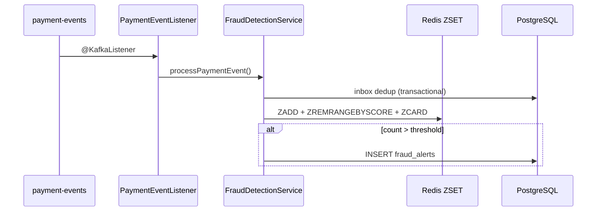

# Fraud Detection Module

Real-time fraud detection service consuming `payment-events` from Kafka and applying velocity checks via Redis sliding windows.

## Architecture



## Sliding Window (Redis Sorted Set)

Key: `fraud:velocity:user:{userId}`

| Step | Redis command | Purpose |
|------|---------------|---------|
| 1 | `ZADD key timestamp eventId` | Record transaction at exact time |
| 2 | `ZREMRANGEBYSCORE key 0 windowStart` | Drop events outside window |
| 3 | `ZCARD key` | Count transactions in sliding window |

Unlike fixed-window `INCR + EXPIRE`, this measures **any consecutive N seconds** accurately.

## Risk rule (MVP)

| Rule | Threshold | Action |
|------|-----------|--------|
| High frequency | > 5 tx / 10 seconds per **user** | Create `HIGH_FREQUENCY` fraud alert |

## Configuration

```yaml
fraud:
  velocity:
    key-prefix: "fraud:velocity:user:"
    window-seconds: 10
    max-transactions: 5
    key-ttl-buffer-seconds: 5

spring:
  kafka:
    bootstrap-servers: localhost:9092
    consumer:
      group-id: fraud-service
```

## Components

| Class | Role |
|-------|------|
| `PaymentEventListener` | `@KafkaListener` on `payment-events` |
| `FraudDetectionService` | Inbox dedup + orchestrate velocity check |
| `SlidingWindowVelocityService` | Redis ZSET sliding window |

## Local test

```bash
docker compose up -d postgres redis kafka
./gradlew :fraud-service:bootRun

# Produce events via payment-service transfer or kafka-console-producer
docker exec -it payment-kafka kafka-console-consumer.sh \
  --bootstrap-server localhost:9092 \
  --topic payment-events \
  --from-beginning
```

After 6+ rapid payments for the same user within 10s, check `fraud_alerts` table.
