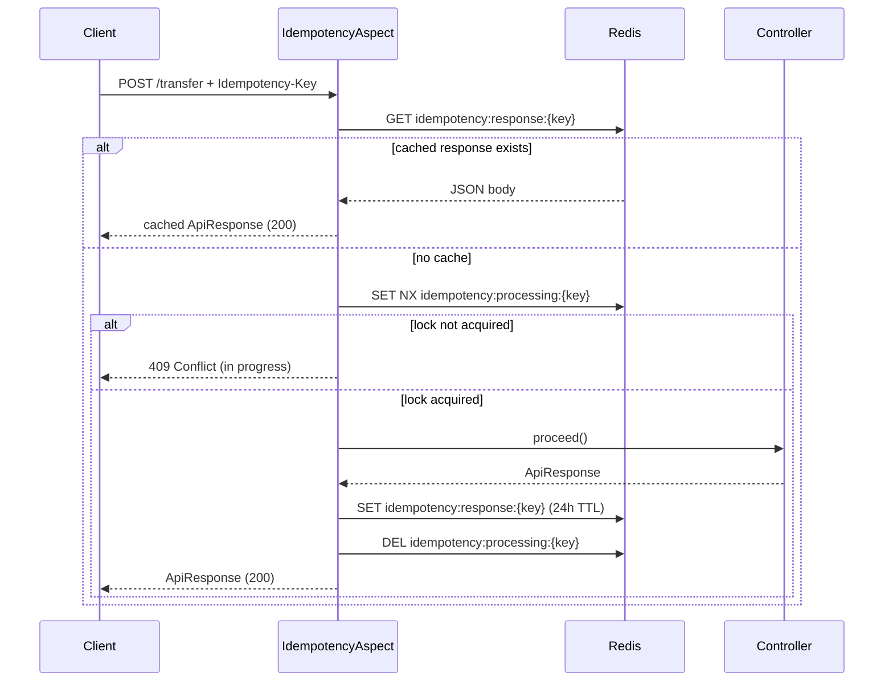

# Idempotency (Redis + AOP)

Payment endpoints that mutate state use declarative idempotency via `@Idempotent` and an AOP aspect backed by Redis.

## Headers

Clients must send one of:

- `Idempotency-Key`
- `X-Idempotency-Key`

Missing header → `400 Bad Request`.

## Flow



## Usage

Annotate a controller method:

```java
@Idempotent
@PostMapping("/transfer")
public ApiResponse<PaymentResponse> transfer(@Valid @RequestBody TransferRequest request) {
    return ApiResponse.ok("Transfer processed", paymentService.transfer(request));
}
```

Read the key inside services with `IdempotencyKeyContext.require()`.

## Configuration

`application.yml`:

```yaml
payment:
  idempotency:
    response-key-prefix: idempotency:response:
    processing-key-prefix: idempotency:processing:
    response-ttl-hours: 24
    processing-ttl-minutes: 5
```

## Layers

| Layer | Purpose |
|-------|---------|
| Redis (AOP) | HTTP-level deduplication; returns cached `ApiResponse` |
| DB `idempotency_key` | Persistent audit + safety if Redis entry expires |

## Reuse in other services

Shared types live in `common-lib`:

- `@Idempotent`
- `IdempotencyHeaders`
- `IdempotencyKeyContext`

Copy `payment-service` idempotency package (`IdempotencyAspect`, `IdempotencyService`, config) and add `spring-boot-starter-aop` + Redis.
