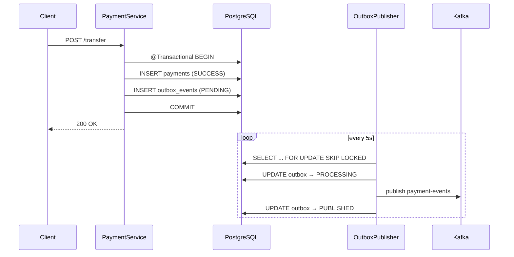

# Transactional Outbox Pattern

Ensures **transactional consistency** between the local PostgreSQL database and Kafka without dual-write failures.

## Flow



## Key design

| Concern | Solution |
|---------|----------|
| Atomic write | `@Transactional` on `PaymentService.transfer()` writes `payments` + `outbox_events` together |
| No inline Kafka | Business code never calls `KafkaTemplate` |
| Async delivery | `@Scheduled` `OutboxPublisher.publishPendingEvents()` |
| Multi-instance safe | `FOR UPDATE SKIP LOCKED` + `PROCESSING` claim |
| Kafka down | Retry with backoff; status `FAILED` after max retries |
| Duplicate Kafka msgs | Consumers use **Inbox pattern** (`message_id` unique) |

## Tables

- **`payments`** — payment invoice / transaction record (renamed from `payment_transactions` via Flyway V3)
- **`outbox_events`** — pending Kafka messages with `status`, `retry_count`, `claimed_at`

## Code map

| Class | Role |
|-------|------|
| `PaymentService` | `@Transactional` — save payment + enqueue outbox |
| `OutboxService` | Build `PaymentCompletedEvent` JSON, insert outbox row |
| `OutboxClaimService` | Claim batch, mark `PROCESSING` |
| `OutboxDispatchService` | Send to Kafka, mark `PUBLISHED` / retry |
| `OutboxPublisher` | `@Scheduled` worker entry point |

## Configuration

```yaml
payment:
  outbox:
    poll-interval-ms: 5000
    batch-size: 50
    max-retries: 5
    initial-retry-delay-seconds: 30
    publish-timeout-seconds: 10
    claim-stale-seconds: 300

spring:
  kafka:
    producer:
      acks: all
      retries: 3
```

## Local verification

```bash
docker compose up -d postgres kafka
./gradlew :payment-service:bootRun

# Watch Kafka topic
docker exec -it payment-kafka kafka-console-consumer.sh \
  --bootstrap-server localhost:9092 \
  --topic payment-events \
  --from-beginning
```

After a successful transfer, check `outbox_events.status` moves from `PENDING` → `PUBLISHED`.
