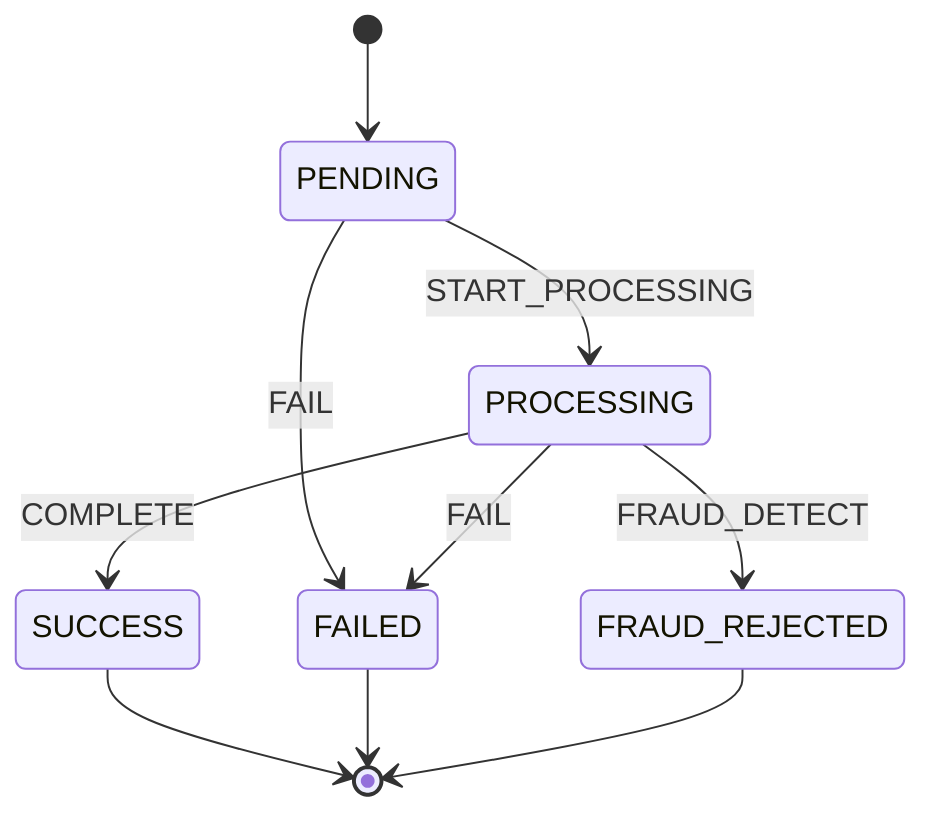

# Payment State Machine

Strict lifecycle control for payment (invoice) status using **Spring State Machine 4.x**.

## State diagram



Terminal states (`SUCCESS`, `FAILED`, `FRAUD_REJECTED`) reject further transitions.

## Events

| Event | From | To |
|-------|------|-----|
| `START_PROCESSING` | PENDING | PROCESSING |
| `COMPLETE` | PROCESSING | SUCCESS |
| `FAIL` | PENDING / PROCESSING | FAILED |
| `FRAUD_DETECT` | PROCESSING | FRAUD_REJECTED |

## Components

| Class | Role |
|-------|------|
| `PaymentStateMachineConfig` | `@EnableStateMachineFactory` — defines states & transitions |
| `PaymentLifecycleService` | Restores current DB state, fires event, validates transition |
| `PaymentService` | Uses lifecycle service during transfer flow |
| `PaymentFraudService` | Marks payment `FRAUD_REJECTED` (called by fraud pipeline) |

## Transfer flow

```text
1. INSERT payments (PENDING)
2. START_PROCESSING → PROCESSING
3. debit wallet
4. COMPLETE → SUCCESS + outbox event
   or FAIL → FAILED on error
```

## Fraud rejection API

```bash
POST /api/payments/{paymentId}/fraud-reject
```

Only valid from `PROCESSING` (or `PENDING` can fail via FAIL). Returns **409** on illegal transition.

## Dependency

```gradle
implementation 'org.springframework.statemachine:spring-statemachine-starter'
// BOM: org.springframework.statemachine:spring-statemachine-bom:4.0.1
```
